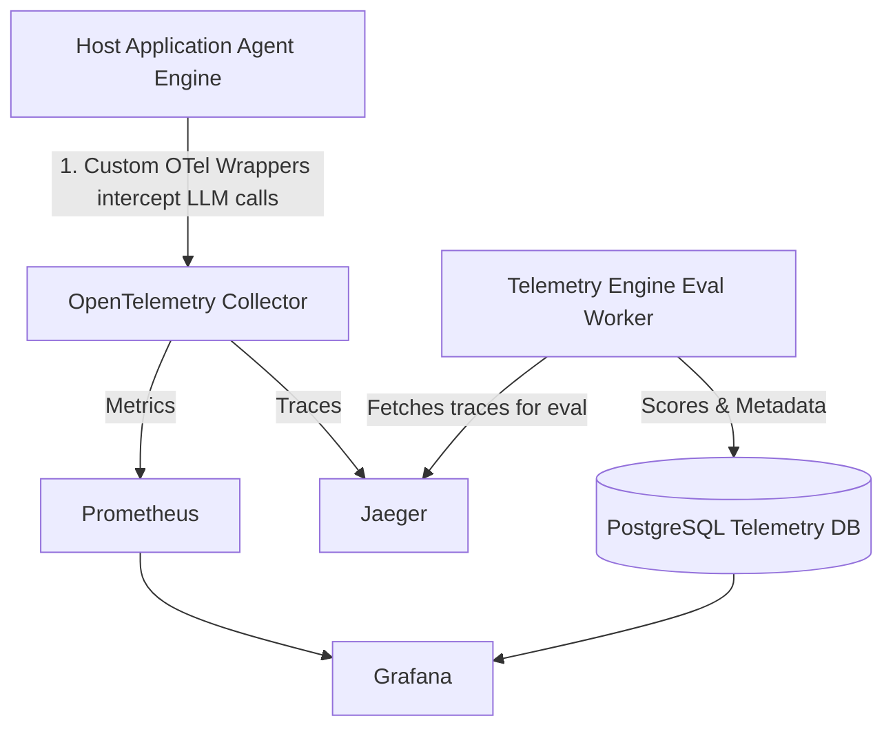

# AI Observability & Telemetry Platform — Architecture Spec

**Context for AI Coder**: This is a standalone observability module designed to sit on top of any LLM application (specifically a multi-agent LangGraph system). It acts as a Datadog for LLMs, tracking costs, latencies, agent execution paths, and hallucination rates.

## Project Overview

A dedicated telemetry plane for LLM applications. It captures distributed traces from agent workflows, aggregates token usage and costs into Prometheus metrics, visualizes execution paths in Jaeger, and runs an asynchronous LLM-as-a-Judge worker to randomly sample and score agent outputs for hallucinations.

**Target Stack & Signal:** OpenTelemetry (OTel) · Jaeger · Prometheus · Grafana · FastAPI · Celery · PostgreSQL · Python decorators/middleware.

## Architecture Topology

The system is split into three layers:
1. **Instrumentation Layer**: Lightweight wrappers inside the host application (Project 1).
2. **Collection & Storage Layer**: Standard open-source observability infra.
3. **Evaluation Layer**: An async worker that scores traces.



## 1. Instrumentation Layer (Shared Library)

**Role**: A drop-in Python package or shared module (`shared_observability`) that instruments any FastAPI route or LangChain/LangGraph node.

### Key Components
* `@trace_llm_call`: A Python decorator that wraps Anthropic/OpenAI API calls.
* `FastAPITelemetryMiddleware`: Injects the `traceparent` header to track requests from the Gateway to the backend.

### Span Attributes Captured (Crucial)
*Fix/Improvement: Be cautious with large payloads. Storing raw prompts and completions directly in OTel attributes can bloat tracing backends and hit size limits. If payloads are large, consider storing them in a blob store (S3/MinIO) and referencing their IDs in the trace, or enforcing attribute length limits.*

```json
{
  "llm.model": "claude-3-5-sonnet-20240620",
  "llm.provider": "anthropic",
  "llm.prompt.tokens": 1450,
  "llm.completion.tokens": 320,
  "llm.cost.usd": 0.0054,
  "agent.node.name": "EVIDENCE_RECONCILER",
  "error": false
}
```

## 2. Telemetry Engine & Eval Worker

**Role**: A standalone worker (FastAPI + Celery/ARQ) that runs asynchronously. It acts as LLM-as-a-Judge.

### Flow
1. Periodically queries the Jaeger API for completed traces tagged with `agent.workflow.complete`.
2. Randomly samples a configurable percentage (e.g., 5%) of these traces.
3. Extracts the raw prompt, retrieved context (from MinIO/Qdrant), and the final LLM completion from the trace data.
4. Feeds this context to an Evaluation Model (e.g., `gpt-4o-mini` or a local `Llama 3` instance) with a strict grading prompt.
5. Evaluates for Factual Consistency (Hallucination), Relevance, and Toxicity.
6. Writes the score to PostgreSQL and exposes it as a Prometheus metric (via a pushgateway or a metrics endpoint).

### Database Schema (`llm_evaluations`)
*Fix/Improvement: Added indexes to optimize Grafana queries based on time and trace ID, and adjusted `trace_id` type to standard OTel trace ID format (usually 32 hex chars).*

```sql
CREATE TABLE llm_evaluations (
    id               UUID PRIMARY KEY DEFAULT gen_random_uuid(),
    trace_id         VARCHAR(32) NOT NULL,
    agent_node       TEXT NOT NULL,
    eval_model       TEXT NOT NULL,
    hallucination_score FLOAT NOT NULL, -- 0.0 (Perfect) to 1.0 (Complete Hallucination)
    relevance_score  FLOAT NOT NULL,
    eval_reasoning   TEXT,
    cost_usd         FLOAT,
    created_at       TIMESTAMPTZ DEFAULT NOW()
);

-- Indexes for performance
CREATE INDEX idx_llm_eval_created_at ON llm_evaluations(created_at);
CREATE INDEX idx_llm_eval_trace_id ON llm_evaluations(trace_id);
CREATE INDEX idx_llm_eval_agent_node ON llm_evaluations(agent_node);
```

## 3. Dashboards & Metrics (Grafana)

The LLM Control Plane Dashboard (`infra/dashboards/llm_control_plane.json`) must include the following PromQL visualizations:

### A. The CFO View (Costs)
* **Total Daily Spend**: `sum(increase(llm_cost_usd_total[24h]))`
* **Cost by Agent Node**: `sum(rate(llm_cost_usd_total[1h])) by (agent_node)` (Shows if the AnomalyDetector is burning more cash than the Summarizer).

### B. The SRE View (Performance)
* **Token Velocity**: `sum(rate(llm_tokens_total[5m])) by (token_type)` (Prompt vs. Completion velocity).
* **Latency p95 by Model**: `histogram_quantile(0.95, sum(rate(llm_inference_duration_seconds_bucket[5m])) by (le, llm_model))`

### C. The AI Engineer View (Quality)
* **Average Hallucination Rate**: `avg_over_time(llm_hallucination_score[1h])`
* **Error Rate by Node**: Ratio of traces containing `error=true` vs total traces per `agent_node`.

## Implementation Order for AI Coder

1. **Spin up Observability Infra**: Add `otel-collector`, `jaeger`, `prometheus`, and `grafana` to `docker-compose.yml`.
2. **Write the OTel Collector Config**: Map incoming gRPC spans to Jaeger (for traces) and Prometheus (for metrics extraction using the `spanmetrics` processor).
3. **Build the Python Instrumentation**: Create the `@trace_llm_call` decorator using `opentelemetry-api` and `opentelemetry-sdk`.
4. **Instrument a Dummy App**: Create a simple FastAPI script that makes fake LLM calls to test the OTel wrapper. Verify traces appear in Jaeger.
5. **Build the Telemetry DB**: Run the Alembic migration for the `llm_evaluations` table.
6. **Develop the Eval Worker**: Write the Python script that fetches a trace from Jaeger's API, runs the LLM-as-a-judge prompt, and saves the score.
7. **Grafana Dashboards**: Expose the PostgreSQL data and OTel metrics to Grafana, and build the 3 views (Cost, SRE, Quality).

## Why this is a Staff-Level Portfolio Flex

Most candidates build an LLM app; almost none build the infrastructure to measure it in production. This architecture proves to a FAANG SRE, DevOps, or AI Engineering recruiter that you understand:
* **Distributed Tracing**: Tracking a request across multiple microservices and agent loops.
* **FinOps**: Controlling and monitoring the variable cost of generative AI.
* **Automated Quality Assurance**: Using CI/CD-style automated evaluations (LLM-as-a-judge) instead of manual testing.
